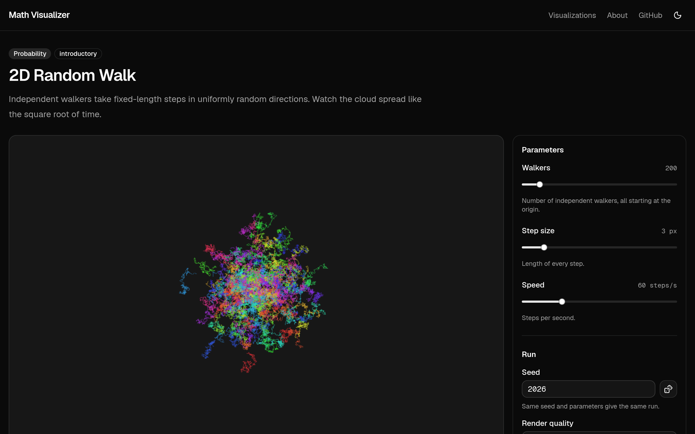

# Math Visualizer

[](https://github.com/stephenmcardle/math-visualizer/actions/workflows/ci.yml)

An open-source, mobile-first web app of interactive visualizations of mathematical systems:
stochastic processes, algorithms, graph structures, dynamical systems and other ideas from
modern mathematical research. Every run is seeded, so a URL reproduces exactly what you saw.

This is an independent community project. It is not affiliated with, endorsed by, or sponsored
by OpenAI or any other organization.

**Live demo:** [mathvisualizer.org](https://mathvisualizer.org)

[](https://mathvisualizer.org/visualizations/random-walk?walkers=200&stepSize=3&speed=60&seed=2026)

---

## Contents

- [Motivation](#motivation)
- [Key features](#key-features)
- [Technology stack](#technology-stack)
- [Architecture overview](#architecture-overview)
- [Directory structure](#directory-structure)
- [Local development](#local-development)
- [Building](#building)
- [Deploying to Cloudflare](#deploying-to-cloudflare)
- [URL and seed reproducibility](#url-and-seed-reproducibility)
- [Adding a new visualization](#adding-a-new-visualization)
- [Contributing](#contributing)
- [Performance philosophy](#performance-philosophy)
- [Accessibility philosophy](#accessibility-philosophy)
- [Roadmap](#roadmap)
- [License](#license)
- [Acknowledgements and research sources](#acknowledgements-and-research-sources)

## Motivation

Many mathematical ideas are easiest to understand by watching them move and poking at their
parameters. Interactive explorations are often one-off pages that are hard to share precisely,
hard to extend, or slow on phones. This project aims to be a shared home for such
visualizations where each one is:

- **interactive**: parameters can be changed while it runs;
- **reproducible**: the same seed and parameters always give the same run;
- **shareable**: the configuration lives in the URL;
- **fast on mobile**: designed for phones first;
- **easy to contribute to**: a visualization is a small, self-contained module;
- **engine-independent**: the math knows nothing about how it is drawn.

## Key features

- Generic visualization host: pages, controls and URL handling are shared; a visualization only
  supplies its parameters, simulation, renderer and metadata.
- Seeded PRNG (sfc32) with pinned regression tests.
- Fixed-step simulation loop: results don't depend on frame rate.
- Shareable URLs such as `/visualizations/random-walk?walkers=100&stepSize=3&speed=30&seed=12345`.
- Parameter controls generated from a schema (sliders with labels, units and descriptions).
- Play/pause, reset, seed entry and randomization.
- Render quality setting (Auto / Low / Medium / High). Auto starts from a device heuristic and
  steps down if frames are persistently slow.
- PixiJS 2D rendering, with Three.js infrastructure ready for 3D visualizations.
- Optional Web Worker execution for CPU-heavy simulations, behind the same interface as
  main-thread execution.
- Long-form MDX explanations, rendered to static HTML at build time.
- Light and dark themes (system default plus toggle), keyboard-accessible controls, reduced-motion
  support.
- Fully static output; no backend, database or accounts.

**Included visualization:** a seeded 2D random walk (isotropic / Pearson random walk) with
configurable walker count, step size and speed. It exists mainly to validate the architecture.

## Technology stack

| Concern           | Choice                                                         |
| ----------------- | -------------------------------------------------------------- |
| Framework         | [Next.js](https://nextjs.org/) 16 (App Router, static export)  |
| Language          | TypeScript (strict)                                            |
| Styling           | Tailwind CSS 4                                                 |
| UI components     | [shadcn/ui](https://ui.shadcn.com/) (Base UI primitives)       |
| 2D rendering      | [PixiJS](https://pixijs.com/) 8                                |
| 3D rendering      | [Three.js](https://threejs.org/) (infrastructure only for now) |
| Long-form content | MDX via `@next/mdx`                                            |
| Themes            | `next-themes`                                                  |
| Tests             | [Vitest](https://vitest.dev/)                                  |
| Lint / format     | ESLint (`eslint-config-next`), Prettier                        |
| Package manager   | npm                                                            |
| Hosting target    | Cloudflare (static assets)                                     |

## Architecture overview

```
              ┌──────────────────────────────────────────────┐
  URL query ─▶│ UI layer (React + shadcn/ui)                  │
  ◀─ replace  │ VisualizationHost: params, seed, play, quality│
              └──────────────┬───────────────────────────────┘
                             │ configuration only (props)
              ┌──────────────▼───────────────────────────────┐
              │ VisualizationViewport (requestAnimationFrame) │
              │  StepClock ─▶ SimulationRunner ─▶ Renderer    │
              └──────┬─────────────────────────────┬─────────┘
                     │                             │
     ┌───────────────▼──────────────┐   ┌──────────▼──────────────┐
     │ Simulation layer (pure TS)    │   │ Renderer layer           │
     │ create(params, seed)          │   │ PixiJS or Three.js       │
     │ step(state, params)           │   │ reset / render / resize  │
     │ main thread or Web Worker     │   │ reads state, never writes│
     └───────────────────────────────┘   └──────────────────────────┘
```

Each visualization is a `VisualizationDefinition` (see `src/lib/visualization/types.ts`):

```ts
interface VisualizationDefinition<S extends ParamSchema, TState> {
  metadata: VisualizationMetadata; // title, category, difficulty, tags, references…
  params: S; // schema → typed params, controls, URL
  simulation: Simulation<ParamValues<S>, TState>;
  stepsPerSecond(params: ParamValues<S>): number;
  execution: "main" | "worker";
  renderer: RendererBinding<ParamValues<S>, TState>; // { engine: "pixi" | "three", load() }
  explanation?: () => Promise<{ default: MDXContent }>;
}
```

Definitions are registered explicitly in `src/visualizations/registry.ts`. The registry
validates slugs and parameter schemas and rejects duplicates. The route
`/visualizations/[slug]` is a generic host that looks definitions up by slug; it contains
no visualization-specific code.

### Simulation layer

`src/lib/simulation/types.ts`

```ts
interface Simulation<TParams, TState> {
  create(params: TParams, seed: number): TState;
  step(state: TState, params: TParams): void; // exactly one fixed step, mutates state
}
```

- Pure TypeScript: no React, DOM, PixiJS or Three.js imports.
- Deterministic: all randomness comes from an `Rng` (`src/lib/random/prng.ts`) stored in the
  state. `Math.random()` is banned in simulation files by an ESLint rule.
- Fixed steps, not wall-clock `dt`: a run is determined by seed, params and step count. The
  viewport's `StepClock` converts elapsed time into a whole number of steps per frame.
- State is plain data (numbers, TypedArrays, plain objects), so it can be structured-cloned to
  and from a worker.

### Renderer layer

`src/lib/rendering/`

```ts
interface VisualizationRenderer<TParams, TState> {
  reset(state, params): void; // new run: discard accumulated visuals
  render(state, params): void; // draw latest state (≤ once per frame)
  resize(context): void; // size or quality changed
  destroy(): void;
}
```

- A visualization supplies a factory: `(app: PIXI.Application, ctx) => renderer` for PixiJS, or
  `({ renderer, scene, camera }, ctx) => renderer` for Three.js.
- `pixi-host.ts` / `three-host.ts` own engine lifecycle: creating the canvas once, device
  pixel ratio, resizing, and cleanup. The PixiJS ticker is disabled; the viewport decides when
  to render, so a paused visualization costs nothing.
- Engines and renderers are loaded with dynamic `import()`, so a page only downloads the engine
  it uses.

### UI layer

`src/components/visualization/`

- `VisualizationHost` holds configuration state: params and seed (via
  `useVisualizationUrlState`), play/pause, quality, and a reset counter. On large screens
  controls sit in a side panel; on small screens they open in a bottom sheet.
- `ParamControls` renders labeled sliders from the parameter schema. A param marked
  `live: true` applies to the running simulation (e.g. speed); others restart it from the seed
  (e.g. walker count).
- `VisualizationViewport` mounts the engine once per visualization and runs the
  `requestAnimationFrame` loop. Per-frame data lives in the loop and refs, never in React state,
  so animation causes no React renders. It handles `ResizeObserver`, device pixel ratio,
  visibility changes (pausing the clock while the tab is hidden), and StrictMode-safe async
  engine setup and teardown.

### Worker layer

`src/lib/simulation/runner.ts`, `worker-runner.ts`, `worker-protocol.ts`,
`src/workers/`

- The viewport talks to a `SimulationRunner` (`reset`, `advance`, `current`, `dispose`).
  `LocalSimulationRunner` runs on the main thread; `WorkerSimulationRunner` runs the same
  simulation in a dedicated Web Worker.
- Switching a visualization to a worker is a one-line change (`execution: "worker"`) plus
  registering its simulation in `src/workers/simulations.ts`. That file is separate from the main
  registry so the worker bundle contains only simulation code. A test enforces that every
  worker-executed definition is registered.
- The worker keeps at most one request in flight and batches steps requested meanwhile, so a
  slow simulation drops frames instead of queueing work. Each reset bumps a generation number so
  stale replies are ignored.
- Snapshots are currently sent by structured clone. Because state is plain TypedArray-friendly
  data, a heavy simulation can later switch to transferring buffers without changing the
  protocol.
- The random-walk demo runs on the main thread (it is cheap), but tests run it through the
  worker protocol to check that results are identical in both modes.

## Directory structure

```
.
├── .github/                      # CI workflow, issue and pull request templates
├── docs/                         # Status, roadmap, capture log, ADRs (see docs/README.md)
├── public/_headers               # Cloudflare cache headers for static assets
├── src/
│   ├── app/                      # Next.js routes
│   │   ├── layout.tsx            # Shell: theme provider, header, skip link
│   │   ├── page.tsx              # /  — intro and visualization grid
│   │   ├── about/page.tsx        # /about
│   │   └── visualizations/[slug]/page.tsx  # generic visualization host page
│   ├── components/
│   │   ├── ui/                   # shadcn/ui components (generated)
│   │   ├── visualization/        # host, viewport, controls, card
│   │   ├── site-header.tsx
│   │   └── theme-toggle.tsx
│   ├── lib/
│   │   ├── random/prng.ts        # seeded PRNG
│   │   ├── rendering/            # renderer contracts, Pixi/Three hosts, quality
│   │   ├── simulation/           # simulation contract, step clock, runners, worker protocol
│   │   ├── url-state/            # param schema, URL parse/serialize, React hook
│   │   ├── visualization/        # definition types and registry factory
│   │   └── site.ts               # project name, description, GitHub URL
│   ├── visualizations/
│   │   ├── registry.ts           # the list of registered visualizations
│   │   └── random-walk/
│   │       ├── params.ts         # parameter schema
│   │       ├── simulation.ts     # pure simulation
│   │       ├── renderer.ts       # PixiJS renderer
│   │       ├── metadata.ts       # title, category, references…
│   │       ├── definition.ts     # ties it all together
│   │       ├── explanation.mdx   # long-form explanation
│   │       └── simulation.test.ts
│   ├── workers/
│   │   ├── simulation.worker.ts  # generic worker entry
│   │   └── simulations.ts        # simulations available in the worker
│   └── mdx-components.tsx        # MDX typography
├── CHANGELOG.md                  # Keep a Changelog
├── CLAUDE.md                     # workflow guide for AI coding agents
├── next.config.ts                # static export + MDX
├── wrangler.jsonc                # Cloudflare deployment config
└── vitest.config.mts
```

There is no per-visualization `controls.tsx`: controls are generated from `params.ts`. See the
[roadmap](#roadmap) for custom controls.

## Local development

Requirements: Node.js ≥ 20.9 (22 LTS recommended) and npm.

```bash
git clone https://github.com/stephenmcardle/math-visualizer.git
cd math-visualizer
npm install
npm run dev            # http://localhost:3000
```

| Command                | What it does                                   |
| ---------------------- | ---------------------------------------------- |
| `npm run dev`          | Dev server with Turbopack                      |
| `npm run lint`         | ESLint                                         |
| `npm run typecheck`    | Generate Next route types, then `tsc --noEmit` |
| `npm test`             | Run Vitest once                                |
| `npm run test:watch`   | Vitest in watch mode                           |
| `npm run format`       | Prettier (write)                               |
| `npm run format:check` | Prettier (check only)                          |
| `npm run build`        | Production static export to `out/`             |
| `npm run check`        | lint + typecheck + test + build                |

## Building

```bash
npm run build
```

`next.config.ts` sets `output: "export"`, so the build writes a fully static site to `out/`
(one HTML file per route, plus hashed JS/CSS under `out/_next/static`). Every
visualization page is prerendered from `generateStaticParams`. The MDX explanation is part of the
static HTML; the interactive viewport hydrates in the browser.

To preview the production build locally, serve `out/` with any static server, for example:

```bash
npx serve out
```

## Deploying to Cloudflare

The app is a static site and is deployed as
[Cloudflare Workers static assets](https://developers.cloudflare.com/workers/static-assets/). No
Worker script, adapter or server runtime is required.

`wrangler.jsonc` is included:

```jsonc
{
  "name": "math-visualizer",
  "compatibility_date": "2026-10-01",
  "assets": { "directory": "./out", "not_found_handling": "404-page" },
  "previews": {},
}
```

Deploy manually:

```bash
npm run build
npx wrangler login        # first time only
npx wrangler deploy
```

The live site at [mathvisualizer.org](https://mathvisualizer.org) deploys automatically with
Workers Builds: the Cloudflare dashboard is connected to this repository, and every merge to
`main` is built and deployed. Its settings:

| Setting         | Value                                                                         |
| --------------- | ----------------------------------------------------------------------------- |
| Worker name     | `math-visualizer` (must match `name` in `wrangler.jsonc`)                     |
| Build command   | `npm run build`                                                               |
| Deploy command  | `npx wrangler deploy`                                                         |
| Preview command | `npx wrangler preview` (a Worker Preview per branch, URL commented on the PR) |
| Path            | `/`                                                                           |
| Build variable  | `NODE_VERSION=22`, matching CI                                                |

The custom domain is attached under the Worker's **Settings → Domains & Routes**.

Notes:

- Extensionless URLs such as `/about` are served from `about.html` by Cloudflare's default
  `html_handling` (`auto-trailing-slash`).
- Unknown paths return `out/404.html`.
- `public/_headers` marks `/_next/static/*` as immutable. Next.js fingerprints those files.
- Next.js features that need a server (route handlers that read the request, middleware/proxy,
  redirects/rewrites/headers in `next.config.ts`, ISR, image optimization) are unavailable with
  static export. If server-side compute is ever needed, the app can move to the
  [OpenNext Cloudflare adapter](https://opennext.js.org/cloudflare) without changing the
  visualization architecture.
- Wrangler is not a project dependency; `npx` fetches it on demand.

## URL and seed reproducibility

- Each visualization's parameters are declared in a schema (`params.ts`). The query string holds
  every parameter plus `seed`:
  `/visualizations/random-walk?walkers=100&stepSize=3&speed=30&seed=12345`.
- On load, `parseParams` reads each parameter, falls back to its default when missing or
  invalid, clamps it to `[min, max]` and snaps it to its `step` grid. Unknown keys are ignored.
- If the URL has no valid `seed` (an integer from 0 to 4294967295), a random one is chosen and
  written to the URL so the run can be shared.
- When you change a control, React state updates immediately and the URL is updated with
  `history.replaceState` after a short debounce. That avoids history spam and Next.js
  navigations, and the URL is never touched by the animation loop.
- All parameters are serialized, not only non-defaults, so a shared link keeps its meaning even if
  a default changes later.
- Determinism comes from three rules:
  1. `create(params, seed)` builds the initial state from the seed via `createRng`;
  2. `step` draws randomness only from the `Rng` in the state;
  3. the loop runs whole fixed steps regardless of frame rate.
- Render quality is a per-device setting. It is not in the URL and does not affect results.
- Caveat: floating point is bit-identical across runs in the same JavaScript engine. Across
  browsers, built-in functions such as `Math.cos` may differ in the last bit. Visualizations
  like the random walk are visually unaffected, but chaotic systems may drift over long runs.

## Adding a new visualization

As an example, here is how to add a hypothetical `bond-percolation` visualization. Use
`src/visualizations/random-walk/` as a reference throughout.

1. **Create the folder** `src/visualizations/bond-percolation/`.

2. **Declare parameters** in `params.ts`:

   ```ts
   import type { ParamSchema, ParamValues } from "@/lib/url-state/params";

   export const percolationParams = {
     size: { label: "Grid size", min: 10, max: 200, step: 1, default: 60 },
     p: { label: "Open probability", min: 0, max: 1, step: 0.01, default: 0.5 },
     speed: { label: "Speed", min: 1, max: 120, step: 1, default: 30, unit: "steps/s", live: true },
   } satisfies ParamSchema;

   export type PercolationParams = ParamValues<typeof percolationParams>;
   ```

   Keys become URL query keys (`seed` is reserved). Mark parameters `live: true` if changing them
   should not restart the run.

3. **Write the simulation** in `simulation.ts`, implementing `Simulation<PercolationParams, State>`:
   - `create(params, seed)` returns plain-data state and stores `createRng(seed)` in it;
   - `step(state, params)` advances one fixed step in place, using `nextFloat(state.rng)` etc.;
   - no React/DOM/PixiJS/Three.js imports and no `Math.random()`;
   - prefer TypedArrays for large numeric state.

4. **Write the renderer** in `renderer.ts`, exporting a `PixiRendererFactory<Params, State>`
   (or `ThreeRendererFactory` for 3D) that returns `{ reset, render, resize, destroy }`. Add
   display objects to `app.stage`, read state in `render`, and free textures and graphics in
   `destroy`. `context.quality.level` lets you reduce detail at low quality.

5. **Describe it** in `metadata.ts` (`VisualizationMetadata`): `slug` (must match the folder
   name, kebab-case), `title`, `description`, `category`, `difficulty`, `tags`,
   `relatedConcepts`, and `references`. List only sources you have actually used.

6. **Optionally explain it** in `explanation.mdx`: what the system represents, how the
   visualization works, its parameters, the mathematical background, and citations. Start
   headings at `##`; the page supplies the `h1`.

7. **Define it** in `definition.ts`:

   ```ts
   export const bondPercolation = defineVisualization({
     metadata: percolationMetadata,
     params: percolationParams,
     simulation: percolationSimulation,
     stepsPerSecond: (params) => params.speed,
     execution: "main",
     renderer: {
       engine: "pixi",
       load: () => import("./renderer").then((m) => m.createPercolationRenderer),
     },
     explanation: () => import("./explanation.mdx"),
   });
   ```

8. **Register it** by adding `bondPercolation` to the array in `src/visualizations/registry.ts`.
   The home page card, the static route `/visualizations/bond-percolation`, the controls and
   URL handling come for free.

9. **(If CPU-heavy) run it in a worker**: set `execution: "worker"` and add
   `"bond-percolation": percolationSimulation` to `src/workers/simulations.ts`.

10. **Test it** in `simulation.test.ts`: at minimum, the same seed and params give identical state
    after N steps, different seeds differ, and any invariants of your system hold. The registry
    test automatically validates your parameter schema.

11. **Check it**: `npm run check`, then try it with `npm run dev` on a narrow viewport, with the
    keyboard, and in both themes.

## Contributing

Contributions are welcome. See [CONTRIBUTING.md](CONTRIBUTING.md) for setup, conventions and the
pull request process, and [CODE_OF_CONDUCT.md](CODE_OF_CONDUCT.md) for community standards.
Project status, the roadmap, the issue capture log and architecture decisions are in
[`docs/`](docs/README.md); notable changes are recorded in [CHANGELOG.md](CHANGELOG.md).
The essentials:

- keep simulation math pure and seeded, and keep renderers read-only;
- cite the papers, books or code your visualization is based on;
- only reuse external code whose license is compatible with Apache-2.0, with attribution;
- make controls keyboard- and touch-friendly;
- run `npm run check` before opening a PR.

## Performance philosophy

- **Mobile first.** Default parameters should run smoothly on a mid-range phone.
- **React is for configuration.** The animation loop lives outside React; changing a slider
  re-renders React once, but frames never do.
- **Fixed-step simulation, variable-rate rendering.** Simulations advance in whole steps; the
  renderer draws at most once per animation frame, and the loop stops entirely when paused.
- **Pay only for what you use.** PixiJS and Three.js are loaded lazily, per page.
- **Quality is adaptive and visual-only.** Quality levels cap the canvas resolution (1×, 1.5×,
  2× device pixels) and let renderers drop detail. Auto mode steps down when frames stay slow.
- **Bounded work per frame.** The step clock caps steps per frame and drops backlog after long
  pauses or hidden tabs.
- **Plan for heavy simulations.** Plain-data state and the runner interface let CPU-heavy work
  move to a Web Worker, with TypedArrays ready for transferable buffers later. Don't optimize
  before it's needed.

## Accessibility philosophy

- Controls are native-semantics components (buttons, sliders, inputs, select) with visible
  labels, keyboard support and visible focus rings.
- Slider values are shown as text next to their labels; descriptions are linked with
  `aria-describedby`.
- A "skip to content" link, landmark regions, and a labeled viewport (`role="img"`).
- Light and dark themes using shadcn/ui's neutral palette.
- `prefers-reduced-motion`: visualizations start paused, with a note explaining how to start
  them.
- Long-form explanations are static HTML, readable without JavaScript.
- Known gap: the canvas content itself is not described to screen readers beyond its label.
  Text alternatives for visual state are on the roadmap.

## Roadmap

The roadmap lives in [docs/ROADMAP.md](docs/ROADMAP.md), organized as milestones with exit
criteria. Current progress is in [docs/STATUS.md](docs/STATUS.md). Highlights of what's next:
a second 2D visualization, a first Three.js visualization and a first worker-executed
visualization.

## License

Licensed under the [Apache License, Version 2.0](LICENSE).

```
Copyright [YEAR] [PROJECT AUTHORS]

Licensed under the Apache License, Version 2.0 (the "License");
you may not use this file except in compliance with the License.
You may obtain a copy of the License at

    http://www.apache.org/licenses/LICENSE-2.0

Unless required by applicable law or agreed to in writing, software
distributed under the License is distributed on an "AS IS" BASIS,
WITHOUT WARRANTIES OR CONDITIONS OF ANY KIND, either express or implied.
See the License for the specific language governing permissions and
limitations under the License.
```

## Acknowledgements and research sources

- Each visualization lists its sources in its `metadata.ts` and on its page. The random walk
  cites K. Pearson, "The Problem of the Random Walk", _Nature_ 72, 294 (1905), and Lord
  Rayleigh's reply in _Nature_ 72, 318 (1905).
- The PRNG is the sfc32 generator by Chris Doty-Humphrey (from the PractRand test suite), seeded
  via splitmix32.
- Built with Next.js, React, PixiJS, Three.js, Tailwind CSS, shadcn/ui, Base UI, and Lucide icons.
  Thanks to their maintainers.

**Guidance for contributors:** if your visualization is based on a paper, book, lecture notes or
existing code, you must cite it in the visualization's metadata and explanation. Prefer DOIs and
arXiv links, and only cite sources you have actually read. Reused code must be under a license
compatible with Apache-2.0, and its license and attribution notices must be preserved. Do not
copy copyrighted text or figures. When unsure, ask in your pull request.
